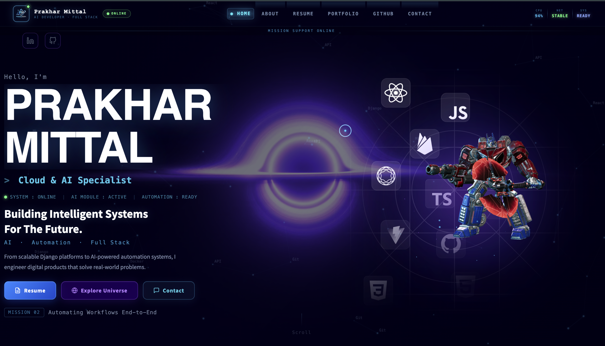
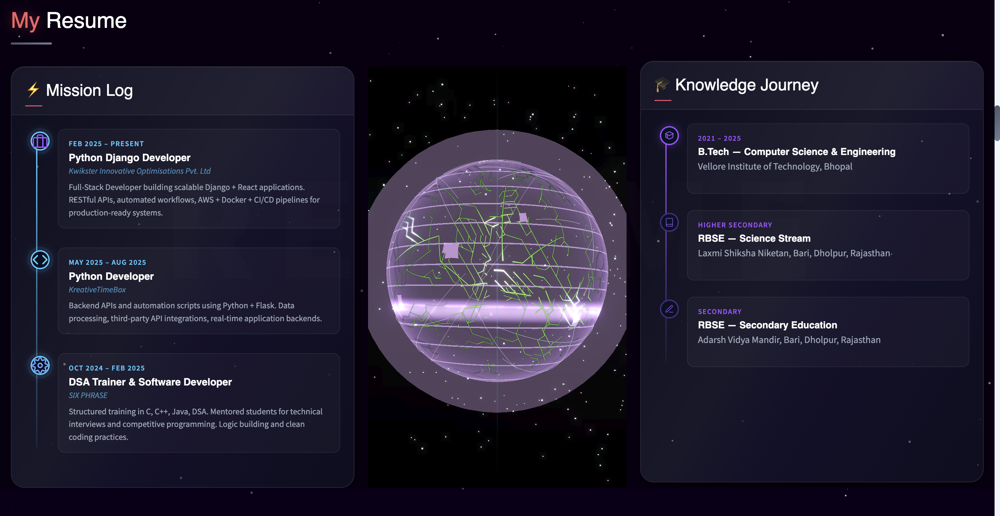
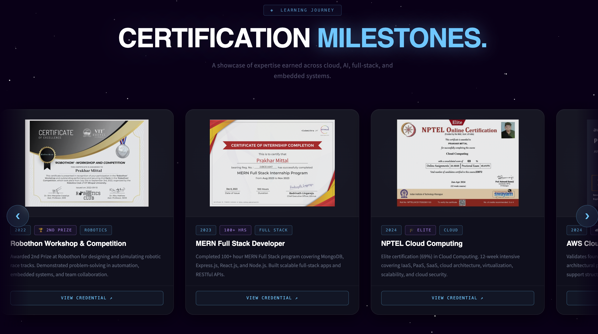
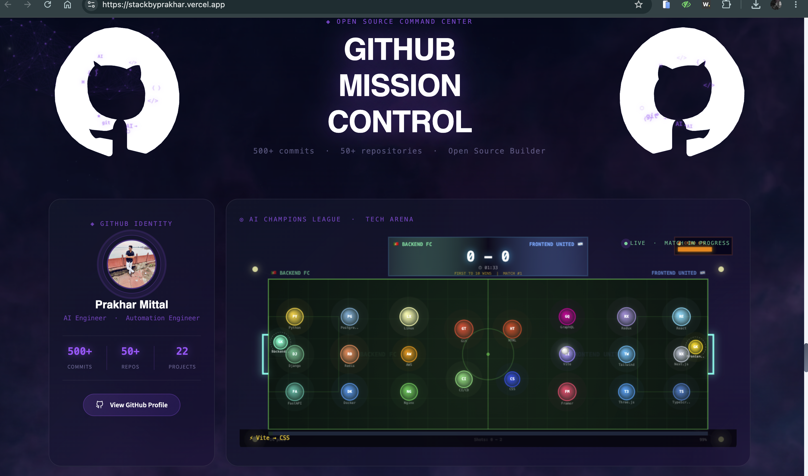
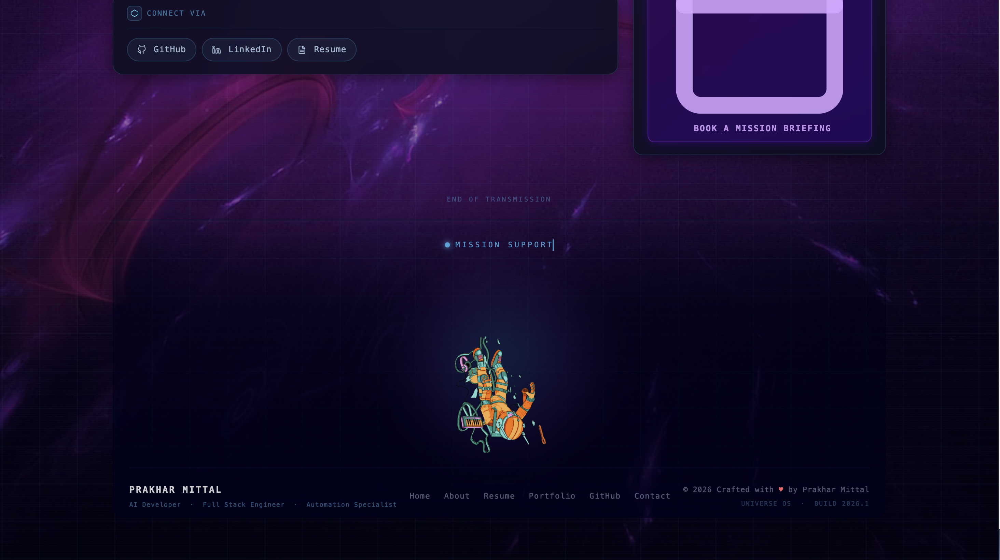

<div align="center">

<!-- BANNER -->


<!-- BADGES -->
<p>
  <a href="https://github.com/prakhau143/Portfolio/stargazers">
    
  </a>
  <a href="https://github.com/prakhau143/Portfolio/network/members">
    
  </a>
  <a href="https://github.com/prakhau143/Portfolio/blob/main/LICENSE.txt">
    
  </a>
  <a href="https://prakhau143.github.io/Portfolio">
    
  </a>
  
  
</p>

<h3>⭐ If this helped you — drop a star! It means everything. ⭐</h3>

</div>

---

## 🚀 Live Demo

> **[→ View Live Portfolio](https://prakhau143.github.io/Portfolio)**

<div align="center">

| Section | Feature |
|---------|---------|
| 🌌 Hero | 3D Spaceman + Blackhole video + constellation canvas |
| 🤖 GitHub MC | Cinematic video bg + live AI Champions League arena |
| 🛸 Skills | Pyramid + orbit nodes + starfield |
| 🎯 Services | Cinematic matrix video + scrolling service pills |
| 📡 Contact | Cyberpunk command center video + EmailJS terminal |
| ☀️ Solar System | 3D Three.js solar system (interactive) |

</div>

---

## 📸 Portfolio Preview

<div align="center">

### 🏠 Hero Section


<br/><br/>

### 💼 Resume & Experience


<br/><br/>

### 🏆 Certifications & Achievements


<br/><br/>

### ⚡ GitHub Mission Control


<br/><br/>

### 📬 Contact & Footer


</div>

---

## 📊 Lighthouse Performance Scores

> Measured on **local build** · headless Chrome (Lighthouse 13.3.0) · Desktop preset · June 2026

<div align="center">

| Metric | Score | Status |
|--------|-------|--------|
| ⚡ Performance | **64** | 🟠 Needs Improvement |
| ♿ Accessibility | **100** | 🟢 Perfect |
| ✅ Best Practices | **100** | 🟢 Perfect |
| 🔍 SEO | **100** | 🟢 Perfect |

</div>

<details>
<summary><strong>📈 Core Web Vitals breakdown</strong></summary>

| Metric | Value | Notes |
|--------|-------|-------|
| First Contentful Paint | 1.4 s | ✅ Fast |
| Largest Contentful Paint | 33.5 s | 3× HD MP4 videos + 2× GLB models |
| Total Blocking Time | 10 ms ✅ | No long JS tasks |
| Cumulative Layout Shift | 0.069 ✅ | Layout very stable |
| Speed Index | 2.6 s | ✅ Fast |

</details>

> **Why performance is lower than a typical site:**
> This portfolio intentionally loads large cinematic assets (HD MP4 videos up to 97 MB,
> Three.js GLB 3D models, WebGL canvases) to create an immersive experience.
> Interactive 3D and cinematic visuals are prioritised over raw load-speed metrics.

> **Optimizations already applied:**
> - IntersectionObserver — 3D renders and videos pause when off-screen
> - `prefers-reduced-motion` — videos hidden for users who prefer less motion
> - `preload="metadata"` on hero video; `preload="none"` on off-screen videos
> - `will-change: opacity, transform` only where needed
> - WebGL renderers stopped via `IntersectionObserver` when section leaves viewport
> - `pointer-events: none` on all decorative layers
> - `preconnect` + `dns-prefetch` hints for all CDN domains
> - `<main>` landmark + correct heading order (WCAG 2.5.5 compliant)
> - All interactive targets ≥ 24×24 px (cert-dot tap zones)

---

## 🏗️ Tech Stack

<div align="center">

| Layer | Technology |
|-------|-----------|
| Structure | HTML5 (single `index.html`) |
| Styling | CSS3 · Glassmorphism · CSS Custom Properties |
| Interactivity | Vanilla JavaScript (ES5/ES6) |
| 3D Engine | Three.js r128 · GLTFLoader · AnimationMixer |
| Animations | Canvas 2D API · CSS animations · GSAP ScrollTrigger |
| Email | EmailJS |
| Deployment | GitHub Pages · Vercel · Netlify |
| CI/CD | GitHub Actions |

</div>

---

## ✨ Features

```
🌌  Blackhole video hero with 3D floating spaceman (GLB model)
🤖  AI Champions League Arena — live Backend FC vs Frontend United simulation
🎵  Cinematic MP4 video backgrounds (GitHub MC · Services Matrix · Contact)
☀️  Interactive 3D Solar System (Three.js)
📊  Animated skill pyramid + orbit tech nodes
🃏  Glassmorphism cards with spotlight hover effects
📡  EmailJS contact terminal (real email delivery)
🎯  Scrolling service pills (marquee with pause-on-hover)
🏆  Certification carousel with keyboard navigation
🎨  Custom cyberpunk cursor with particle trail
📱  Fully responsive — mobile · tablet · desktop
♿  prefers-reduced-motion respected throughout
⚡  IntersectionObserver — videos and 3D pause when off-screen
```

---

## 🛠️ Clone & Build Your Own Portfolio

Anyone can fork this and turn it into their own portfolio in under 30 minutes.

### Prerequisites

```bash
# Node.js (optional — only for gulp tasks)
node --version   # v18+ recommended
```

### 1. Fork & Clone

```bash
# Click the "Fork" button at the top of this page, then:
git clone https://github.com/YOUR_USERNAME/Portfolio.git
cd Portfolio
```

### 2. Install Dependencies (optional)

```bash
npm install
```

### 3. Customize Content

All content lives in **`public_html/index.html`**. Search for these markers:

| What to change | Search for |
|---------------|------------|
| Your name | `Prakhar Mittal` |
| Your title | `AI Engineer · Full Stack Developer` |
| Social links | `linkedin.com/in/its-prakhar-mittal` |
| GitHub link | `github.com/prakhau143` |
| Email (EmailJS) | `mittalprakhar504@gmail.com` |
| Resume link | `href="assets/imgs/resume.pdf"` |
| Skills / tech | `BD=[ ... ]` and `FD=[ ... ]` (Arena teams) |
| Projects | Search `<!-- projects-grid -->` |
| Certifications | Search `<!-- cert-track -->` |

### 4. Replace Assets

```
public_html/assets/imgs/
├── tenhun_falling_spaceman_fanart.glb   ← your hero 3D model
├── fnaf_security_breach_teaser_map.glb  ← contact background model
├── github.mp4                           ← GitHub section video
├── service_matrix.mp4                   ← services section video
├── contact_panel.mp4                    ← contact section video
├── 10882975-uhd_3840_2160_30fps.mp4     ← hero blackhole video
└── resume.pdf                           ← your resume
```

### 5. Set Up EmailJS (for contact form)

1. Go to [emailjs.com](https://www.emailjs.com/) → create a free account
2. Create a service (Gmail / Outlook)
3. Create an email template
4. In `index.html` search for `emailjs.init(` and replace the public key
5. Update `SERVICE_ID` and `TEMPLATE_ID` in the `sendEmail()` function

### 6. Deploy

**Option A — GitHub Pages (free, automatic)**
1. Push to `main` branch
2. Go to repo **Settings → Pages → Source: gh-pages branch**
3. GitHub Actions (`.github/workflows/deploy.yml`) handles the rest automatically ✅

**Option B — Vercel (zero config)**
```bash
# Import repo at vercel.com → auto-detects vercel.json → deploys instantly
```

**Option C — Netlify**
```bash
# Import repo at netlify.com → auto-detects netlify.toml → deploys instantly
```

---

## 📂 Project Structure

```          
Portfolio/
├── .github/
│   └── workflows/
│       └── deploy.yml          # GitHub Actions → auto-deploy to gh-pages
├── public_html/
│   ├── index.html              # ← The entire portfolio (single file)
│   └── assets/
│       ├── imgs/               # Images, GLB models, MP4 videos
│       └── css/                # (legacy — most CSS is inline in index.html)
├── vercel.json                 # Vercel static deploy config
├── netlify.toml                # Netlify static deploy config
├── package.json                # Gulp tasks (optional)
└── gulpfile.js                 # Build tasks (optional)
```

---

## 🤝 Contributing

Contributions are welcome! Here's how:

```bash
# 1. Fork the repo
# 2. Create a feature branch
git checkout -b feat/your-feature

# 3. Make your changes
# 4. Commit
git commit -m "feat: describe your change"

# 5. Push and open a Pull Request
git push origin feat/your-feature
```

---

## ⭐ Support This Project

If this portfolio template saved you time or inspired your work:

<div align="center">

| Action | How |
|--------|-----|
| ⭐ **Star** | Click the ★ Star button at the top of this repo |
| 🍴 **Fork** | Click the ⑂ Fork button to use as your own template |
| 🐛 **Report bugs** | Open a [GitHub Issue](https://github.com/prakhau143/Portfolio/issues) |
| 💬 **Connect** | [LinkedIn](https://www.linkedin.com/in/its-prakhar-mittal) |

**Starring takes 2 seconds and helps others discover this project. 🙏**

</div>

---

## 👨‍💻 About Me

**Prakhar Mittal** — AI Engineer & Full Stack Developer from Bhopal, India.

- 🎓 B.E. Computer Science @ VIT Bhopal University
- 💼 Specializing in AI/ML systems, Django REST APIs, FastAPI, React
- ☁️ AWS | Docker | Redis | PostgreSQL | CI/CD
- 📧 mittalprakhar504@gmail.com
- 🔗 [LinkedIn](https://www.linkedin.com/in/its-prakhar-mittal) · [GitHub](https://github.com/prakhau143)

---

## 📄 License

This project is licensed under the **MIT License** — see [LICENSE.txt](LICENSE.txt) for details.

You are free to use, modify, and distribute this template for personal and commercial use.

---

<div align="center">


**Made with ❤️ by [Prakhar Mittal](https://github.com/prakhau143)**

*If this helped you land your next job or impress a client — I'd love to hear about it!*

[](https://github.com/prakhau143)
[](https://github.com/prakhau143/Portfolio/stargazers)

</div>
